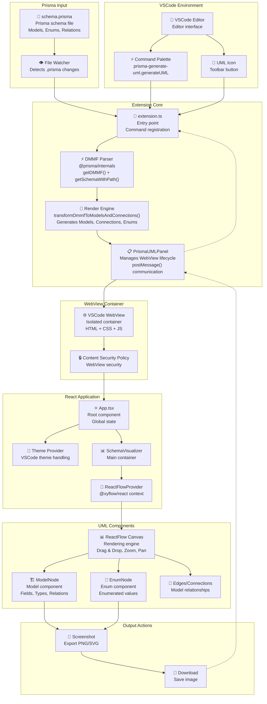

<br />
<p align="center">
    <a href="#" target="_blank"></a>
    <br />
    <br />
    <b>Prisma Generate UML</b> is a VSCode extension that quickly creates UML diagrams from Prisma schemas with a single click, offering easy visualization.
    <br />
    <br />
</p>

> _You can download final bundles from the [Releases](https://github.com/AbianS/prisma-generate-uml/releases) section._

      

> [!NOTE]
> 🚧
> **Prisma Generate UML** is currently under development. Stay tuned for more updates!

## 🏗️ Architecture



## 📦 Project Structure

```
prisma-generate-uml/
├── packages/
│   ├── prisma-generate-uml/     # VSCode Extension
│   │   ├── src/
│   │   │   ├── extension.ts     # Entry point
│   │   │   ├── panels/          # WebView management
│   │   │   └── core/            # Rendering logic
│   │   └── package.json
│   │
│   ├── webview-ui/              # React Frontend
│   │   ├── src/
│   │   │   ├── App.tsx          # Main component
│   │   │   ├── components/      # UML Components
│   │   │   └── lib/             # Utils and types
│   │   └── package.json
│   │
│   └── schema.prisma            # Example schema
│
├── turbo.json                   # Turbo configuration
└── package.json                 # Root workspace
```

## 🚀 Development

### Prerequisites

- Node.js 18+
- npm

### Installation

```bash
# Clone the repository
git clone https://github.com/AbianS/prisma-generate-uml.git
cd prisma-generate-uml

# Install dependencies
npm install

# Development
npm run dev
```

## ✨ Features

- 🔥 **Instant UML Diagrams**: Generate UML diagrams from Prisma schemas with a single click
- 🖼 **Easy Visualization**: Simplify data architecture visualization in an exciting way
- 🛠 **Seamless Integration**: Works seamlessly within VSCode, no extra configuration required
- 📂 **Multi-file Prisma Schema Support**: Full support for Prisma's `prismaSchemaFolder` feature
- 🔃 **Automatic Updates**: Keep your UML diagrams up-to-date with schema changes

## 🏃‍♂️ Quick Usage

1. Open a `.prisma` file in VSCode
2. Look for the UML icon in the editor toolbar
3. Click it to generate the diagram instantly

## 🛠️ Technologies

- **Extension**: TypeScript + VSCode Extension API
- **WebView**: React + Vite + Tailwind CSS
- **UML Rendering**: React Flow + Custom Components  
- **Prisma Integration**: @prisma/internals DMMF
- **Monorepo**: Turbo + npm workspaces
- **Code Quality**: Biome (ESLint + Prettier alternative)

## 📄 License

MIT License - see [LICENSE](LICENSE) for more details.
